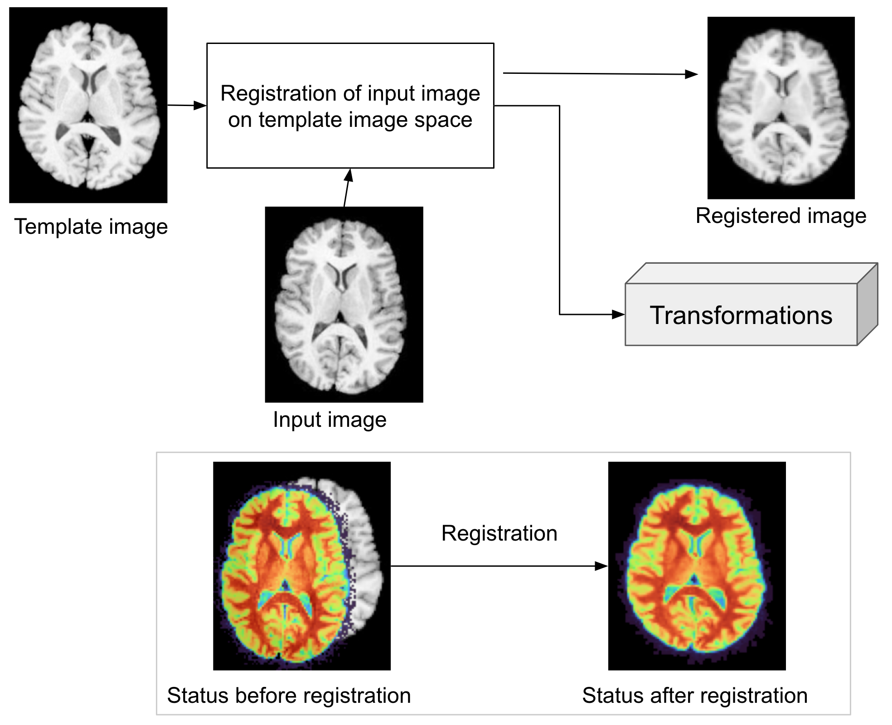

# 3D Medical Image Registration & Segmentation

[](https://doi.org/10.5281/zenodo.19184221)



**NAIC WP7 Use Case 4** — 3D image registration for brain tumor segmentation, aligning multi-modal MRI scans (T1, T1Gd, T2, FLAIR) to provide a unified view of patient anatomy.

**Tutorial:** [https://naicno.github.io/wp7-UC4-medical-image-registration/](https://naicno.github.io/wp7-UC4-medical-image-registration/)

## Modality Overview

| Modality | Clinical Role |
| :--- | :--- |
| **T1 / T1Gd** | Detailed brain anatomy; gadolinium highlights active tumor tissue |
| **T2** | Sensitive to fluids, revealing edema and infiltration |
| **FLAIR** | Differentiates CSF from lesions, especially near ventricles |

## Importance

- **Comprehensive Tumor Analysis**: Combines strengths of each modality for precise tumor delineation and volume estimation.
- **Enhanced Monitoring and Research**: Facilitates consistent tumor monitoring and development of automated segmentation algorithms.

## Tools and Process

- Utilizes **HD-BET** (brain extraction) and **ANTsPy** (registration).
- Steps: **N4 Bias correction**, **rigid** registration of modalities to T1Gd, T1Gd to SRI-24 atlas, and applying transformations.

## Quick Start

### Using Conda

```bash
git clone https://github.com/NAICNO/wp7-UC4-medical-image-registration.git
cd wp7-UC4-medical-image-registration
conda env create -f environment.yml
conda activate 3d-image-registration-segmentation
```

### On NAIC Orchestrator

1. Provision a VM at [https://orchestrator.naic.no](https://orchestrator.naic.no)
2. SSH into the VM and clone the repository
3. Run the orchestrator notebook: `demonstrator-v1.orchestrator.ipynb`

## Repository Structure

```
├── src/                    # Registration pipeline source code
├── notebooks/              # Jupyter demonstrator notebooks
├── content/                # Sphinx tutorial
├── tests/                  # Test suite
├── assets/                 # Figures and diagrams
├── environment.yml         # Conda environment specification
└── .github/workflows/      # CI + Pages workflows
```

## Contributors

- **Saruar Alam** (UiB)

## License

Dual license: [CC BY-NC 4.0](https://creativecommons.org/licenses/by-nc/4.0/) (content) + [GPL-3.0-only](https://www.gnu.org/licenses/gpl-3.0.txt) (code). See [LICENSE](LICENSE).
